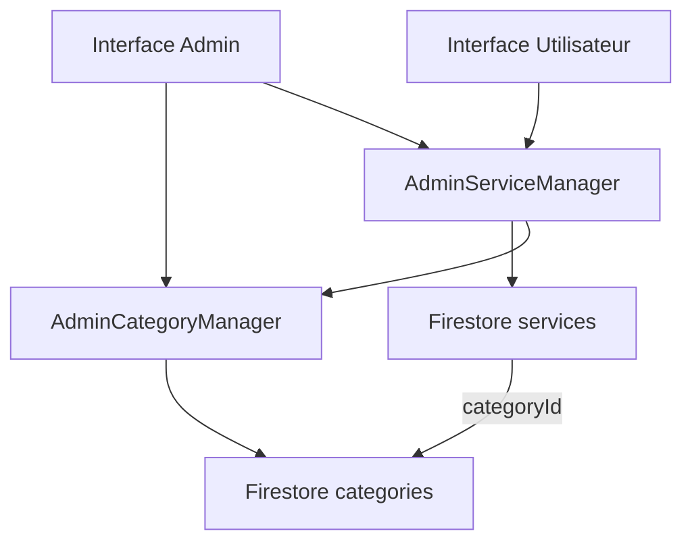

# Correction des données statiques dans AdminServiceManager

## 🔍 Problème identifié

### Fichiers en double avec données statiques
- ❌ **Supprimé** : `admin_service_manager_firestore.dart` (doublon avec catégories statiques)
- ❌ **Supprimé** : `admin_service_manager_fixed.dart` (doublon avec données statiques)
- ✅ **Conservé** : `admin_service_manager.dart` (fichier principal, maintenant corrigé)

### Catégories codées en dur
```dart
// AVANT - Catégories statiques
final List<Map<String, String>> categories = [
  {'id': 'cat1', 'name': 'Nettoyage'},
  {'id': 'cat2', 'name': 'Réparation'},
  // ...
];
```

```dart
// APRÈS - Catégories dynamiques depuis Firestore
final AdminCategoryManager _categoryManager = AdminCategoryManager();

Future<List<CategoryModel>> getCategories() async {
  return await _categoryManager.getCategories();
}
```

## 🛠️ Corrections apportées

### 1. Suppression des fichiers en double
```bash
# Fichiers supprimés
admin_service_manager_firestore.dart
admin_service_manager_fixed.dart
```

### 2. Intégration du gestionnaire de catégories

#### Import ajouté
```dart
import '../../categories/admin_category_manager.dart';
```

#### Singleton de catégories
```dart
final AdminCategoryManager _categoryManager = AdminCategoryManager();
```

#### Suppression des catégories statiques
```dart
// SUPPRIMÉ
final List<Map<String, String>> categories = [...];
```

### 3. Méthodes de catégories mises à jour

#### Accès aux catégories
```dart
/// Obtenir toutes les catégories
Future<List<CategoryModel>> getCategories() async {
  return await _categoryManager.getCategories();
}

/// Obtenir les catégories actives
Future<List<CategoryModel>> getActiveCategories() async {
  return await _categoryManager.getActiveCategories();
}
```

#### Catégories avec compteurs
```dart
Future<List<Map<String, dynamic>>> getCategoriesWithCount() async {
  await _ensureDataLoaded();
  
  final categories = await _categoryManager.getCategories();
  return categories.map((category) {
    final count = _cachedServices
        .where((service) => service.categoryId == category.id)
        .length;
    return {
      'id': category.id, 
      'name': category.name, 
      'count': count,
      'color': category.color.value,
      'icon': category.iconName,
    };
  }).toList();
}
```

### 4. Services par défaut avec catégories dynamiques

#### Initialisation des catégories
```dart
Future<void> _createDefaultServices() async {
  // S'assurer que les catégories par défaut existent
  await _categoryManager.initializeDefaultCategories();
  
  final categories = await _categoryManager.getCategories();
  if (categories.isEmpty) {
    print('Aucune catégorie disponible pour créer les services par défaut');
    return;
  }
  
  final defaultServices = await _getDefaultServices(categories);
  // ...
}
```

#### Services liés aux vraies catégories
```dart
Future<List<ServiceModel>> _getDefaultServices(List<CategoryModel> categories) async {
  final categoryMap = {for (var cat in categories) cat.name: cat};
  
  final services = <ServiceModel>[];
  
  // Nettoyage
  if (categoryMap.containsKey('Nettoyage')) {
    final cat = categoryMap['Nettoyage']!;
    services.add(ServiceModel(
      // ...
      categoryId: cat.id,        // ID réel de Firestore
      categoryName: cat.name,    // Nom réel de Firestore
      // ...
    ));
  }
  // ...
}
```

## 📊 État après correction

### ✅ AdminServiceManager - Entièrement Firestore
- **Services** : Collection `services` ✅
- **Catégories** : Via `AdminCategoryManager` ✅
- **Pas de données statiques** : Tout vient de Firestore ✅

### ✅ Workflow de données complet
1. **Catégories** → Firestore (`categories`)
2. **Services** → Firestore (`services`) avec `categoryId` référençant les vraies catégories
3. **Interface admin** → Chargement dynamique des catégories et services
4. **Interface utilisateur** → Synchronisation automatique

### ✅ Initialisation intelligente
```dart
// Au premier lancement
_categoryManager.initializeDefaultCategories()  // Crée les catégories de base
↓
_createDefaultServices()                        // Crée des services avec les vraies catégories
↓ 
Services avec categoryId réel                   // Références cohérentes
```

## 🔄 Architecture finale des données



## 🎯 Avantages de cette correction

1. **Cohérence** : Plus de données dupliquées ou contradictoires
2. **Flexibilité** : Catégories entièrement configurables
3. **Performance** : Cache intelligent pour les deux entités
4. **Maintenance** : Un seul point de vérité pour chaque type de données
5. **Évolutivité** : Facile d'ajouter de nouvelles fonctionnalités

## 🧪 Tests à effectuer

1. **Créer une catégorie** dans l'interface admin
2. **Créer un service** avec cette catégorie
3. **Vérifier côté utilisateur** que le service s'affiche avec la bonne catégorie
4. **Modifier la catégorie** et vérifier la mise à jour des services
5. **Supprimer une catégorie** (doit être bloqué s'il y a des services)

## 📝 Notes importantes

- ✅ **Un seul fichier** : `admin_service_manager.dart`
- ✅ **Zéro données statiques** : Tout depuis Firestore
- ✅ **Références cohérentes** : Services liés aux vraies catégories
- ✅ **Gestion d'erreurs** : Fallback intelligent
- ✅ **Cache optimisé** : Performances maintenues
