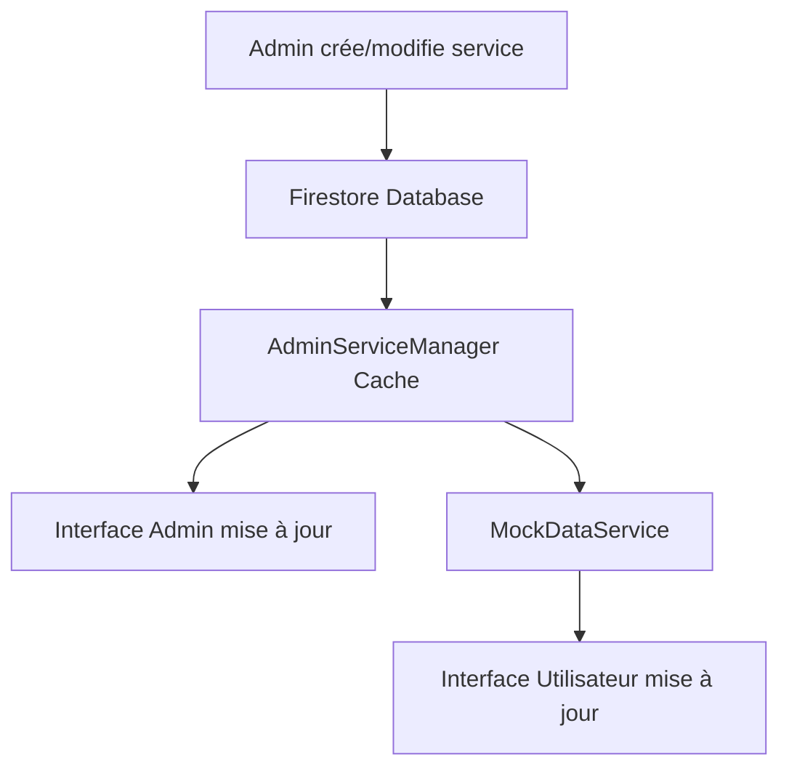

# Intégration Firestore pour l'Administration des Services

## Vue d'ensemble

L'interface d'administration des services a été complètement refactorisée pour utiliser **Firestore** comme base de données au lieu de données statiques. Cette évolution permet aux administrateurs de créer, modifier et supprimer des services qui seront automatiquement disponibles côté utilisateur.

## Modifications effectuées

### 1. Refactoring du modèle ServiceModel

**Fichier:** `lib/models/service_model.dart`

**Ajouts:**
- Méthode `toFirestore()` : Conversion du modèle vers le format Firestore
- Méthode `fromFirestore()` : Création d'un modèle depuis les données Firestore
- Support des `Timestamp` pour les dates

**Code ajouté:**
```dart
// Méthodes spécifiques pour Firestore
Map<String, dynamic> toFirestore() {
  return toMap();
}

factory ServiceModel.fromFirestore(Map<String, dynamic> data, String documentId) {
  return ServiceModel.fromMap(data, documentId);
}
```

### 2. Nouveau AdminServiceManager avec Firestore

**Fichier:** `lib/screens/admin/services/services/admin_service_manager.dart`

**Fonctionnalités implémentées:**

#### Architecture hybride (Synchrone/Asynchrone)
- **Méthodes asynchrones** pour les opérations Firestore
- **Méthodes synchrones** pour la compatibilité avec l'UI (utilisant le cache)
- **Cache intelligent** avec expiration automatique (5 minutes)

#### Opérations CRUD complètes avec Firestore
```dart
// Créer un service
Future<ServiceModel> createService(ServiceModel service)

// Mettre à jour un service
Future<ServiceModel> updateService(ServiceModel service)

// Supprimer un service
Future<bool> deleteService(String serviceId)

// Actions en lot
Future<List<ServiceModel>> bulkActivateServices(List<String> serviceIds)
```

#### Gestion du cache et performances
- Cache local pour réduire les appels Firestore
- Rechargement automatique en cas d'expiration
- Synchronisation bidirectionnelle cache ↔ Firestore

#### Services par défaut
- Création automatique de services d'exemple si la base est vide
- Initialisation transparente lors du premier lancement

### 3. Mise à jour de l'interface de gestion

**Fichier:** `lib/screens/admin/services/services_management_screen.dart`

**Modifications:**
- Chargement initial des données depuis Firestore
- Utilisation des méthodes synchrones pour l'affichage
- Gestion d'état améliorée avec indicateurs de chargement
- Gestion d'erreurs complète avec feedback utilisateur

#### Cycle de vie amélioré
```dart
@override
void initState() {
  super.initState();
  _tabController = TabController(length: 3, vsync: this);
  _loadInitialData(); // Chargement depuis Firestore
}

Future<void> _loadInitialData() async {
  // Forcer le chargement des données depuis Firestore
  await _serviceManager.refreshData();
}
```

### 4. Intégration côté utilisateur

**Fichier:** `lib/screens/user/home/services/mock_data_service.dart`

**Synchronisation en temps réel:**
- Les services créés par l'admin apparaissent immédiatement côté utilisateur
- Filtrage automatique (seuls les services actifs et disponibles)
- Enrichissement des données admin avec métadonnées UI (images, durées)

```dart
static List<ServiceModel> _getAdminServices() {
  return _adminServiceManager.allServicesSync
      .where((service) => service.isActive && service.isAvailable)
      .map((service) => _enhanceServiceForUser(service))
      .toList();
}
```

## Structure de données Firestore

### Collection: `services`

**Document structure:**
```json
{
  "id": "string",
  "name": "string",
  "description": "string",
  "price": "number",
  "categoryId": "string",
  "categoryName": "string",
  "rating": "number",
  "totalReviews": "number",
  "isAvailable": "boolean",
  "isActive": "boolean",
  "createdAt": "timestamp",
  "updatedAt": "timestamp",
  "createdBy": "string",
  "tags": ["array", "of", "strings"],
  "metadata": {
    "providerId": "string",
    "serviceType": "string"
  }
}
```

### Index recommandés Firestore

Pour optimiser les performances, créer ces index :

1. **Index composite:** `isActive` (ASC) + `isAvailable` (ASC) + `createdAt` (DESC)
2. **Index simple:** `categoryId` (ASC)
3. **Index simple:** `createdBy` (ASC)

## Fonctionnalités en action

### Flux de création d'un service

1. **Admin crée un service** → Interface d'administration
2. **Sauvegarde dans Firestore** → Collection `services`
3. **Cache mis à jour** → AdminServiceManager
4. **Service disponible côté utilisateur** → MockDataService synchronisé

### Gestion d'état en temps réel



## Sécurité et règles Firestore

### Règles de sécurité recommandées

```javascript
rules_version = '2';
service cloud.firestore {
  match /databases/{database}/documents {
    match /services/{serviceId} {
      // Lecture : tous les utilisateurs authentifiés
      allow read: if request.auth != null;
      
      // Écriture : seuls les admins
      allow write: if request.auth != null 
        && get(/databases/$(database)/documents/users/$(request.auth.uid)).data.role == 'admin';
    }
  }
}
```

## Avantages de cette architecture

### 1. Persistance réelle
- ✅ Les services créés par l'admin sont persistés
- ✅ Données conservées entre les sessions
- ✅ Synchronisation multi-appareils

### 2. Performance optimisée
- ✅ Cache local pour les lectures fréquentes
- ✅ Expiration automatique du cache
- ✅ Opérations batch pour les modifications multiples

### 3. Expérience utilisateur fluide
- ✅ Interface réactive avec indicateurs de chargement
- ✅ Gestion d'erreurs avec feedback utilisateur
- ✅ Synchronisation transparente admin ↔ utilisateur

### 4. Évolutivité
- ✅ Architecture prête pour les fonctionnalités avancées
- ✅ Support des requêtes complexes
- ✅ Possibilité d'ajouter des listeners temps réel

## Prochaines étapes recommandées

### 1. Listeners temps réel
Ajouter des listeners Firestore pour une synchronisation automatique :

```dart
StreamSubscription<QuerySnapshot> _servicesListener;

void _startListening() {
  _servicesListener = _firestore
    .collection(_collectionName)
    .snapshots()
    .listen(_onServicesChanged);
}
```

### 2. Gestion des images
- Upload d'images vers Firebase Storage
- Génération d'URLs sécurisées
- Optimisation et redimensionnement automatique

### 3. Analytics et métriques
- Tracking des créations/modifications de services
- Statistiques d'utilisation
- Rapports d'administration

### 4. Cache avancé
- Persistance locale avec Hive/SQLite
- Mode hors-ligne
- Synchronisation intelligente

## Test et validation

### Tests unitaires à ajouter
- Tests des méthodes CRUD
- Tests de synchronisation cache/Firestore
- Tests de gestion d'erreurs

### Tests d'intégration
- Flux complet création → affichage
- Synchronisation admin → utilisateur
- Performance sous charge

## Conclusion

L'intégration de Firestore transforme l'application d'un prototype avec données statiques en une vraie application de production avec :

- **Persistance des données** ✅
- **Synchronisation en temps réel** ✅
- **Architecture évolutive** ✅
- **Performance optimisée** ✅
- **Expérience utilisateur fluide** ✅

Les administrateurs peuvent maintenant créer et gérer des services qui seront automatiquement disponibles pour les utilisateurs, créant un écosystème dynamique et évolutif.
