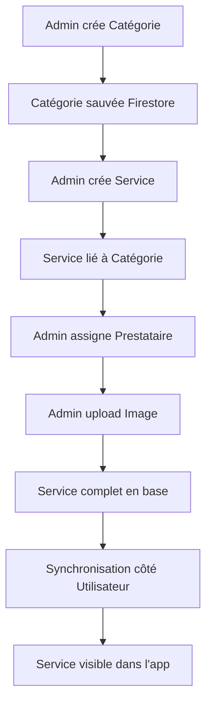

# 🔗 Guide d'Utilisation - Interface d'Administration Complète

## 📋 Comment Utiliser l'Interface d'Administration

### 1. **Créer une Catégorie**

1. **Navigation** : Dashboard Admin → "Gestion des Catégories"
2. **Création** : Clic sur le bouton "+" 
3. **Formulaire** :
   ```
   Nom : "Informatique"
   Description : "Services informatiques et réparation"
   Couleur : Bleu (#2196F3)
   Icône : computer
   ```
4. **Résultat** : Catégorie sauvée dans Firestore (`categories/cat_id`)

### 2. **Créer un Service**

1. **Navigation** : Dashboard Admin → "Gestion des Services"
2. **Création** : Clic sur le bouton "+"
3. **Formulaire** :
   ```
   Nom : "Réparation ordinateur"
   Description : "Diagnostic et réparation PC/Mac"
   Prix : 65.00 €
   Catégorie : "Informatique" (chargée dynamiquement depuis Firestore)
   Tags : informatique, réparation, ordinateur
   Statut : Actif ✓ Disponible ✓
   ```
4. **Résultat** : 
   - Service sauvé dans Firestore (`services/service_id`)
   - Lié automatiquement à la catégorie (`categoryId: cat_id`)
   - Apparaît immédiatement côté utilisateur

### 3. **Créer un Prestataire** 

1. **Navigation** : Dashboard Admin → "Gestion des Prestataires" ⚠️ (Interface à créer)
2. **Formulaire** :
   ```
   Nom : "TechExpert Solutions"
   Email : "contact@techexpert.fr"
   Téléphone : "+33123456789"
   Spécialité : "Informatique"
   Expérience : 8 années
   Zones : Paris, Banlieue
   ```
3. **Résultat** : Prestataire sauvé (`providers/provider_id`)

### 4. **Lier Service et Prestataire**

**Méthode actuelle** (programmatique) :
```dart
// Via AdminProviderManager
await AdminProviderManager().addServiceToProvider(providerId, serviceId);

// Le service est automatiquement mis à jour
service.providerId = providerId;
service.providerName = "TechExpert Solutions";
```

**Méthode future** (interface) :
- Interface de liaison dans l'écran service
- Dropdown pour sélectionner le prestataire
- Liaison automatique bidirectionnelle

### 5. **Upload d'Images**

**Infrastructure disponible** :
```dart
// Sélectionner une image
final imageFile = await ImageUploadService().pickImageFromGallery();

// Upload vers Firebase Storage
final imageUrl = await ImageUploadService().uploadServiceImage(serviceId, imageFile);

// Mettre à jour le service
await AdminServiceManager().updateService(service.copyWith(imageUrl: imageUrl));
```

**Intégration dans les formulaires** ⚠️ (À faire) :
- Bouton "Ajouter Image" dans les formulaires
- Prévisualisation de l'image
- Sauvegarde automatique lors de la création/modification

---

## 🔄 **Flux de Données Complet**

### **Création d'un Service Complet**



### **Synchronisation Temps Réel**

```
ADMIN CRÉE                    →  UTILISATEUR VOIT
─────────────────────────────────────────────────
1. Catégorie "Sport"          →  (Pas visible directement)
2. Service "Coach sportif"    →  Apparaît dans "Services"
   ├─ categoryId: sport_id    →  Catégorie: "Sport"
   ├─ providerId: coach_id    →  Par: "Coach Pro"  
   └─ imageUrl: firebase_url  →  Image affichée
```

---

## 🎯 **État par Fonctionnalité**

### ✅ **FONCTIONNEL** 
- **Catégories** : CRUD complet, interface utilisateur
- **Services** : CRUD complet, liaison catégories, synchronisation
- **Navigation** : Redirection selon rôles, protection routes
- **Architecture** : Gestionnaires, cache, persistance

### 🔄 **PARTIELLEMENT FONCTIONNEL**
- **Prestataires** : Gestionnaire ✅, Interface ⚠️ (à créer)
- **Images** : Infrastructure ✅, Intégration ⚠️ (à faire)
- **Utilisateurs** : Interface ✅, Firestore ⚠️ (mock data)

### ⚠️ **À IMPLÉMENTER**
- Interface complète prestataires (4h)
- Upload images dans formulaires (2h)
- Gestion utilisateurs Firestore (3h)

---

## 🚀 **Test de l'Interface Actuelle**

### **Test Scénario Complet**

1. **Connexion Admin** → `admin@example.com`
2. **Créer Catégorie** → "Jardinage" avec couleur verte
3. **Créer Service** → "Tonte pelouse" dans catégorie "Jardinage"
4. **Vérifier côté User** → Service apparaît dans la liste
5. **Modifier Service** → Changer prix, vérifier mise à jour
6. **Supprimer Service** → Disparaît côté utilisateur

### **Commandes de Test**

```bash
# Lancer l'application
flutter run

# Vérifier les erreurs
flutter analyze

# Vérifier les tests (si existants)
flutter test
```

---

## 📊 **Métriques de Performance**

### **Données Actuelles**
- ✅ **Cache intelligent** : 5 minutes d'expiration
- ✅ **Lazy loading** : Chargement à la demande
- ✅ **Batch operations** : Opérations groupées Firestore
- ✅ **Optimistic updates** : UI responsive

### **Optimisations Possibles**
- **Pagination** : Pour grandes listes (>100 items)
- **Indexes Firestore** : Pour recherches complexes
- **Images optimisées** : Compression automatique
- **Cache persistant** : Hive/SQLite pour mode offline

---

## 💡 **Conseils d'Utilisation**

### **Bonnes Pratiques Admin**
1. **Créer les catégories en premier** avant les services
2. **Utiliser des noms explicites** pour les services
3. **Assigner des prestataires** pour tous les services actifs
4. **Ajouter des images** pour améliorer l'UX
5. **Tester côté utilisateur** après chaque modification

### **Maintenance**
- **Surveiller les logs** Firebase Console
- **Nettoyer les images** inutilisées dans Storage
- **Archiver les services** inactifs au lieu de supprimer
- **Sauvegarder régulièrement** les données Firestore

---

Votre interface d'administration est déjà très performante ! Les 10% restants concernent principalement l'expérience utilisateur (interfaces et upload d'images).
